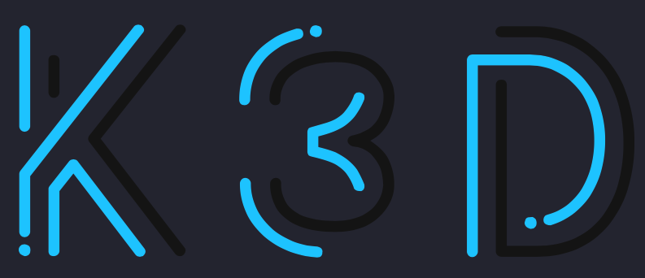

# K3D Demo

[k3d](https://k3d.io) is a lightweight wrapper to run [k3s](https://k3s.io) (Rancher Lab’s minimal Kubernetes distribution) in docker.

[k3d](https://k3d.io) makes it very easy to create single- and multi-node [k3s](https://k3s.io) clusters in docker, e.g. for local development on Kubernetes

[Install instructions](https://k3d.io/#installation)

## Create cluster

When running the below command from the project root folder, a 1 server, 4 agent k3s cluster will be created on your local machine.

    $ k3d cluster create --config k3d.yaml

Test the state of the cluster by running this command

    $ kubectl get nodes

Destroy / Dlete the cluster using the following command

    $ k3d cluster delete --config k3d.yaml
